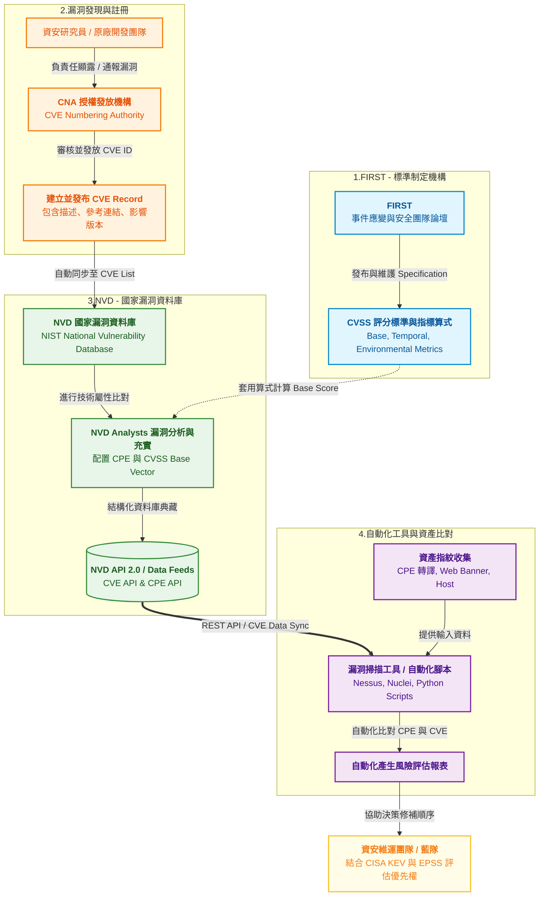

## 前言

> **Q: 同樣是高分漏洞，為什麼修補優先序還是不同？**

想像一下，如果今天有兩間銀行都發表了安全性警告：

- A 銀行金庫的安全系統被發現有設計上的缺陷，理論上只要拿特定工具就能破解（CVSS 9.8 分）。但這座金庫在地下三層、有 24 小時警衛輪流看守、且入口有紅外線偵測系統需要特定權限才能通過。
- B 銀行的線上網銀系統被發現漏洞，駭客只要在自家客廳連上網，輸入一串特殊字串就能直接轉走別人的錢（CVSS 9.8 分）。

雖然以上兩個情境的「技術危害程度」在評分上都是 9.8 分（0~10分），但身為一個合格資安人，在看到這兩個漏洞的當下，絕對是先去通報處理 B 銀行的網銀系統，而非急著處理 A 銀行。

這個簡單的例子點出了許多企業在做漏洞管理時的痛點，同時回答以上問題：

> **A: CVSS 基本分數（Base Score）只是認識風險的入口，其背後的向量字串（Vector String）與情境資訊，才是決定『今天該優先修哪一個漏洞』的核心。**

## 什麼是 CVSS？它存在的意義是什麼？

### CVSS（Common Vulnerability Scoring System）是什麼？

> CVSS 是一套由國際組織 NIAC 制定的「漏洞技術嚴重度共通評分框架」。

每個漏洞都會被指派一個由 0.0 至 10.0 的評分來代表它的**技術嚴重性**：

* 低（0.1~3.9）
* 中（4.0~6.9）
* 高（7.0~8.9）
* 嚴重（9.0~10.0）

如果把資安界比喻成「急診室」，CVSS 分數就像是護理師在急診室為病患進行的「檢傷分類（Triage）」。當一個新漏洞（病患）被送進來時，CVSS 會根據它的創傷程度（技術影響力）在評估後給出一個 0.0 到 10.0 的分數，提供給世界各地的工程師一種標準化語言，並且說明：「這個漏洞到底有多嚴重？」

### CVSS 可以做什麼，不能做什麼？

#### Can Do: 標準化比較漏洞的技術風險

* 它的用意其實就是能夠去打破不同廠商之間的資訊壁壘。不管是微軟的 Windows、Google 的 Chrome 還是 Fortinet 的防火牆出現漏洞，大家都能用同一套公式，客觀地計算出該漏洞在「技術層面」的威脅強度。

#### Can't Do: 單獨決定『你的』修補優先權

* CVSS 基本分數評估的是漏洞在「理論預設情境」下的嚴重度，但它完全不知道你的網路架構。這就像醫生知道「心臟病發作」非常致命（高 CVSS），但如果這個病患現在只是一隻實驗室裡的白鼠，急診室顯然應該先去救一位大腿動脈破裂這種活生生的人（雖然動脈破裂的原始評分可能較低）。只看 CVSS 分數做決策，往往會讓團隊陷入盲目修補的窘境之中（警報疲勞）。

## 誰在管理與維護 CVSS？

### FIRST 是誰？為何它能維護 CVSS 標準？

目前 CVSS 規格由非營利國際組織 **FIRST（Forum of Incident Response and Security Teams**，事件應變與安全團隊論壇） 全權維護與管理（旗下設有專門的 CVSS SIG 工作小組）。

且因為 FIRST 這個組織具備獨立、中立的這些特性，CVSS 才能成為全球科技業公認並採納的唯一權威標準。

### CVSS 與 NVD、CNA、掃描工具的關係

- FIRST（規則制定者）： 只負責訂立 CVSS 的遊戲規則與計算公式，自己通常不直接去為各個漏洞打分數。
- CNA（CVE 授權發放機構，如各大原廠）： 當軟體發現漏洞時，CNA 負責給予這個漏洞一個身份證字號（CVE ID）。
- NVD（國家漏洞資料庫，執行者）： 美國官方的 NVD 分析師會讀取漏洞的技術細節，套用 FIRST 的公式計算出官方的 CVSS 分數與 Vector，並公開給全世界查詢。
- 掃描工具（落地應用者）： 像是 Nessus、Qualys 或企業內部的自動化腳本，會定期同步 NVD 的數據，並比對企業內部的電腦，跳出告警提示。

這也解釋了為什麼同一漏洞在不同資料源可能看到不同資訊：有時原廠（CNA）認為自己的軟體有預設防禦措施，因而給出較低的分數；但 NVD 的分析師採用較保守嚴格的標準，就會計算出較高的 CVSS 分數。

## CVSS 版本演進全線：v1 → v2 → v3.0 → v3.1 → v4.0

### 為什麼需要持續改版？

簡單來說就是因為技術瞬息萬變，而為了能夠因應環境而給出更標準符合情境的評估分數，因此需要持續地更新評分系統。但大體原因就是以下兩點：
- 威脅情境變化快速
- 舊版語意不夠精細

### 歷史時間軸（表格）
| Version | 發布年代 | 核心變化 | 解決痛點 |
|---|---:|---|---|
| v1 | 早期版本 | 初代評分框架 | 建立共同評分起點 |
| v2 | 廣泛採用期 | 指標更完整 | 提升一致性 |
| v3.0 | 現代化重構 | 指標語意大幅更新 | 更貼近實務風險判讀 |
| v3.1 | v3 修訂 | 文件與定義澄清 | 提升評分一致性 |
| v4.0 | 2023 年底更新最新版 | 指標群組再擴充（含 Threat/Supplemental） | 更貼近真實優先級決策 |

## CVSS Vector 是什麼？為什麼你不能只看分數？

### Vector 的本質：漏洞的「風險指紋」

如果把 CVSS 分數比喻成一個學生的「總成績單」，那麼 CVSS Vector（向量字串）就是「各考科的詳細成績冊」。

當我們聽到某個漏洞獲得 CVSS 9.8 分 時，這只是一個經過數學算式壓縮後的統計數字，告訴我們這個漏洞在技術嚴重性上「非常棘手」。然而，數字本身無法呈現技術特性的全貌。兩個同樣高達 9.8 分的漏洞，背後的攻擊型態與防禦難度可能截然不同：

- 漏洞 A：可能是一個需要攻擊者先登入系統、擁有特定權限，但一旦成功就能把整台伺服器提權並炸毀的「內網破壞型」漏洞。
- 漏洞 B：則可能是一個完全不需要身分驗證、攻擊者只要遠端發送一個封包就能竊取資料的「外網無聲滲透型」漏洞。

因此不能只單看 9.8 這個數字，而是需要搭配 CVSS Vector 漏洞的「風險指紋」一同分析。它用一串標準化的文字結構，完整記錄了這個漏洞的攻擊途徑、門檻高低以及造成的影響範疇。

### 如何閱讀一段 Vector（示例拆解）

一段標準的 CVSS Vector 通常看起來像一串由冒號與斜線組成的密碼，例如：
`CVSS:3.1/AV:N/AC:L/PR:N/UI:N/S:U/C:H/I:H/A:H`

簡單來說就是（Key:Value）組合而成的英文字母字串，後續會針對每一版本的字串做更詳細的介紹！

## 不同版本的 Vector Metrics 差異

每個 CVSS Versions 都有各自存在的 Metrics（指標），具體表格如下：

### 表 A：Metric Groups（指標群組）版本對照
| Metric Group (英文) | 指標群組（中文） | v2 | v3.0 | v3.1 | v4.0 |
|---|---|---|---|---|---|
| Base Metrics | 基礎指標 | ✅ | ✅ | ✅ | ✅ |
| Temporal / Threat Metrics | 時序/威脅指標 | ✅（Temporal） | ✅（Temporal） | ✅（Temporal） | ✅（Threat） |
| Environmental Metrics | 環境指標 | ✅ | ✅ | ✅ | ✅ |
| Supplemental Metrics | 補充指標 | ❌ | ❌ | ❌ | ✅ |

### 表 B：Base Metrics 欄位演進（版本差異重點）
| Version | Metrics（英文） | 指標（中文） | 重點說明 |
|---|---|---|---|
| v2 | AV, AC, Au, C, I, A | 攻擊向量、攻擊複雜度、驗證需求、機密性/完整性/可用性影響 | 舊版欄位定義 |
| v3.x | AV, AC, PR, UI, S, C, I, A | 攻擊向量、攻擊複雜度、權限需求、使用者互動、範圍、CIA影響 | 引入 Scope、PR、UI |
| v4.0 | （將於下篇細拆） | （將於下篇細拆） | 結構更貼近現代風險決策 |

可能會有人有疑問，所以統一說明，從 CVSS v3.0 到 v3.1 **並沒有改變計算公式或新增欄位**，分數計算結果基本上一致。

而 v3.1 的主要改變在於『修訂標準說明與定義』：官方補充了更嚴謹的評分指引（特別是 Attack Complexity 與 Scope 的判定），降低不同分析師對同一漏洞評分不一致的情況；同時**強調 CVSS 只代表『技術嚴重性』**，企業評估『實際風險』時仍需搭配情資（如 CISA KEV）進行綜合判斷。」

## 總結

講完 CVSS 的一些基礎知識後，這邊還是特別說明一下，不同團隊機構或企業在看待 CVEs 的時候一定會有些微的差異，可能會相對應採取不同的處理方式。而通常一般情況下，較為保險以及標準的方式為：

- 先看 CVSS 版本，再看分數（v1 & v2.0 通常已被全數淘汰）。目前最常用的還是 v3.x/v4.0 的版本
- 先分析 Vector，再談漏洞優先序
- CVSS 分數是 **Severity Level（技術嚴重性）!= Risk Level（實際風險）**

> ***CVSS 分數是共通語言，是一個作為參考的基準，但並非絕對！***

## 下回預告

下一篇將會進入 CVSS v4.0 重點，也就是在 2023 年 11 月更新的最新版本，針對不同的風險漏洞提供更準確詳盡的評估情境，以確保不會出現 Critical/ High severity 過多而導致 Alert Fatique 警報疲勞的現象（浪費大量維運資源以及成本）：
- Base / Threat / Environmental / Supplemental 四種 Metrics 指標
- B、BT、BE、BTE 評分類型
- 如何把評分結果落地成修補優先級

## Reference

- FIRST CVSS 官方首頁：https://www.first.org/cvss/
- FIRST CVSS v3.1 Specification：https://www.first.org/cvss/v3.1/specification-document
- FIRST CVSS v4.0 Specification：https://www.first.org/cvss/v4-0/specification-document
- NVD Vulnerability Metrics：https://nvd.nist.gov/vuln-metrics